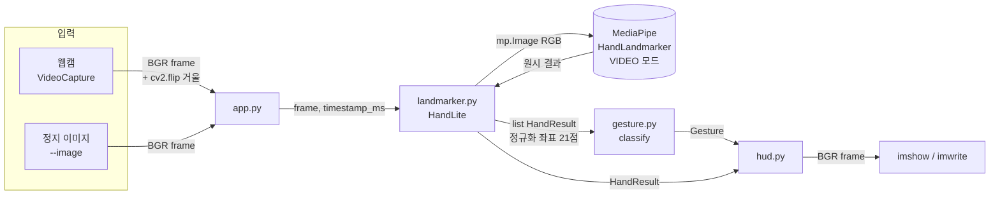

# Architecture — mediapipe/hand_lite

> 최종 갱신: 2026-07-29

---

## 1. 설계 원칙 — 계약으로 자른다

4개 모듈이 **`types.py` 하나만 공유**하고 서로의 내부를 모른다.
이 분리는 미학이 아니라 **검증 가능성**을 위한 것이다.

| 모듈 | 외부 의존 | 카메라 없이 테스트 |
|---|---|---|
| `types.py` | 없음 | — (자료형) |
| `gesture.py` | **없음** (types만) | **100%** ✅ |
| `hud.py` | cv2, PIL | 렌더 결과 파일로 확인 가능 |
| `landmarker.py` | mediapipe, cv2 | 로드·예외·계약 준수만 |
| `app.py` | 위 전부 + cv2 | `--image` 경로만 |

`gesture.py`가 mediapipe도 cv2도 import하지 않는 것이 핵심이다.
**프로젝트에서 유일하게 완전 검증되는 층**이며, 실제로 이 층에서
가장 중요한 결함(엄지 판정)이 잡혔다.

---

## 2. 데이터 흐름



**계약 경계는 `landmarker.py` 출구**다. MediaPipe 원시 객체는 여기서
`HandResult`로 변환되어 밖으로 나가지 않는다. 덕분에 `gesture.py`와
`hud.py`는 MediaPipe 버전 변화에 영향받지 않는다.

---

## 3. 좌표계 규약 (버그의 단골 지점)

| 대상 | 단위 | 주의 |
|---|---|---|
| `Landmark.x, y` | **정규화 0.0~1.0** | 픽셀 아님. 그릴 때만 `int(x * width)` |
| `Landmark.z` | 손목 기준 상대 깊이 | 현재 코드는 **사용하지 않음** |
| `HandResult.score` | handedness 분류 확률 | **손 검출 신뢰도가 아니다.** Tasks API는 별도 검출 점수를 주지 않음 |
| `handedness` | `'Left'` / `'Right'` | `gesture.py`는 **참조하지 않는다**(4절) |

---

## 4. 제스처 판정 — 왜 handedness를 버렸나

**초기 설계 (폐기)**

```python
if hand.handedness == "Right": thumb = lm[4].x > lm[3].x
else:                          thumb = lm[4].x < lm[3].x
```

이 규칙은 "카메라 입력이 미러링되지 않았다"는 **숨은 전제** 위에 있었다.
그런데 `app.py`는 거울 모드를 위해 `cv2.flip(frame, 1)`을 하고 검출한다 —
전제를 스스로 깨고 있었다. 실사진 정확도 **0/6**.

**현재 설계**

```python
ratio = distance(THUMB_TIP, INDEX_MCP) / distance(WRIST, MIDDLE_MCP)
thumb = ratio > 0.57
```

거리는 좌우 반전에 불변이므로 **전제 자체가 필요 없어졌다.**
`cv2.flip`과의 충돌도 함께 소멸했다. 실사진 정확도 **6/6**.

> 설계 교훈: 전제가 깨질까 보정하는 것보다, 전제가 없는 설계로 바꾸는 편이 낫다.

**임계값 0.57의 근거** — 실사진 6장 실측 분포:

```
굽음: 0.217, 0.266                    → 최대 0.266
펴짐: 0.865, 0.900, 0.923, 1.058      → 최소 0.865
빈 구간 0.266~0.865 (폭 0.598) 의 중앙 = 0.57
   0.40 → 마진 0.134 · 0.75 → 마진 0.115 · 0.57 → 마진 0.295
```

---

## 5. VIDEO 모드 — 조건부 최적화

`landmarker.py`는 `running_mode=VIDEO` + `detect_for_video()`를 쓴다.

| 조건 | IMAGE | VIDEO |
|---|---:|---:|
| 손 검출률 (실제 손 동영상) | 50.7% | **68.0%** |
| 중앙값 지연 | 235.96 ms | 80.01 ms |
| 손 **없는** 노이즈 프레임 | 29.93 ms | **32.01 ms** (느림) |

MediaPipe 그래프의 `PreviousLoopbackCalculator`가 이전 프레임의 손을 되먹여
팜 디텍터를 건너뛴다. **되먹일 손이 없으면 그 경로가 돌지 않고** 타임스탬프
동기화 비용만 남아 손해다.

**타임스탬프 계약**: VIDEO 모드는 단조 증가를 요구하며 **동일값도 거부**한다
(역행뿐 아니라). 벽시계(`time.time()*1000`)는 빠른 루프에서 같은 ms가 두 번
나와 크래시하므로, `app.py`는 `frame_index * 33`을 쓴다.

**자원 해제**: MediaPipe 1.0.0은 `close()` 후 `detect_for_video()` 호출을
막지 않고 그냥 성공한다(해제된 네이티브 자원 접근). `HandLite`가 `RuntimeError`
가드를 넣어 막는다.

---

## 6. 파일 구조

```
mediapipe/hand_lite/
├── hand_lite/
│   ├── types.py        계약 — 수정 시 전 모듈 영향
│   ├── landmarker.py   MediaPipe 래퍼 (VIDEO 모드, 계약 변환)
│   ├── gesture.py      순수 함수 — 21점 → Gesture
│   ├── rps.py           가위바위보 규칙 — judge · MoveStabilizer(제스처 흔들림 보정) · Score
│   └── hud.py          렌더 (한글은 PIL 경유, cv2.putText는 CJK 불가)
├── app.py              웹캠 / --image 두 경로 — 손 추적만 하는 최소 데모
├── rps_game.py           app.py 위에 가위바위보 승부 판정을 얹은 진입점
├── doctor.py             웹캠 진단 도구 — --no-camera로 1~2단계는 카메라 없이도 재현 가능
├── bench.py            용량·속도 실측 ([사실]/[추정] 라벨 분리)
├── models/
│   └── hand_landmarker.task   7.5 MB (저장소 포함)
├── tests/
│   ├── test_gesture.py     합성 fixture + 실사진 6장 회귀 (22개)
│   ├── test_landmarker.py  로드·예외·계약 seam (25 + 1 skip)
│   └── test_rps.py          승부 판정·AI 수 결정성·안정화 로직 (33개)
├── README.md             학생용 빠른 시작 + 벤치마크 실측 + 알려진 한계
├── TUTORIAL.md           학생용 단계별 실습 교재
├── WEBCAM_VERIFY.md      웹캠 실검증 체크리스트 (사람이 직접 확인해야 하는 마지막 관문)
└── docs/               prd.md · progress.md · architecture.md
```

**빌드 경위**: `rps.py`/`rps_game.py`(가위바위보 게임), `doctor.py`/`WEBCAM_VERIFY.md`
(웹캠 진단), `README.md`/`TUTORIAL.md`(학생 교재)는 각각 `feature/rps-game`,
`feature/webcam-verify`, `feature/docs` 워크트리에서 독립적으로 개발된 뒤
`main`에 병합되었다(6절 구조는 병합 완료 후 최종 상태). 세 브랜치 모두
`gesture.py`의 엄지 임계값(0.57)을 main 기준으로 통일한 뒤 병합해, 충돌 없이
`git merge --no-ff`로 들어갔다.

---

## 7. 외부 자산 의존

실사진 회귀 테스트와 벤치마크는 **옆 프로젝트** `../../yolo/rps/`를 읽는다
(테스트 픽스처 6장, 동영상, YOLO 모델 2종). 쓰기는 하지 않는다.

경로는 `_find_workshop_root()`로 **조상 디렉토리를 탐색**해 찾는다.
`.parent.parent.parent` 같은 고정 깊이를 쓰면 워크트리(`.worktrees/*/tests/`)에서
경로가 어긋나 실사진 테스트 6개가 **조용히 skip**된다 — 실제로 겪은 사고다.
`bench.py`와 `tests/test_gesture.py` 양쪽에 같은 방식이 들어 있다.
